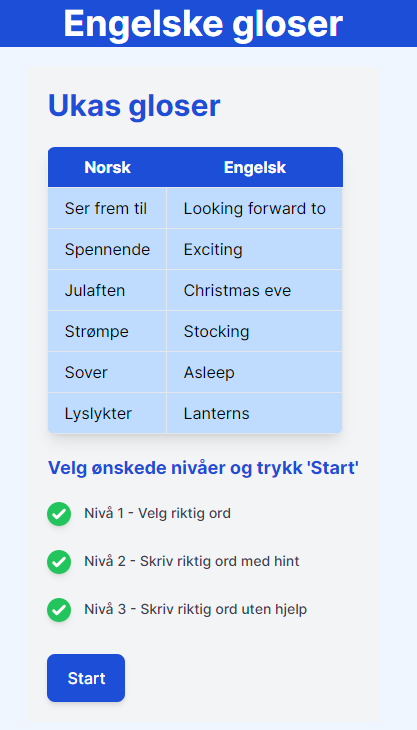

# Gloser

## Description
A small web application implemented in Ruby on Rails used by 10-year old norwegians to learn english words and phrases.

For each week a set of words/phrases are used as a basis for practicing translation from norwegain to english and vice versa.

The application is made like a game, and it currently have three levels.
  - Level 1 - Select the correct translation
  - Level 2 - Write the correct translation with the solution scrambled.
  - Level 3 - Write the correct translation.

A user will be presented with the words of the week and select what levels to include in the game(Run).
For level one and two one point is awarded for the correct answer. For level three, two point.
At the end of the game, the player is preseted with the total score.

Currently words has to be adde manually in the database or using the console. An admin interface to add words might come in the future.

## Ruby version
3.2.2

## System dependencies
- PostgreSQL - UUID usded for primary key in Run to prevent users from "hijacking" other users runs.

## Configuration
- Configure your database in `config/database.yml`

## Database initialization
- Run `rails db:create` to create the database.
- Run `rails db:migrate` to run migrations.

## How to run the test suite
- Run `rails test` to run the test suite.

## License
- This project is licensed under the MIT License.
